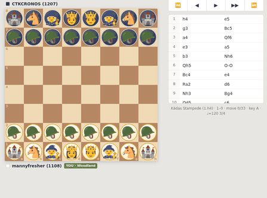
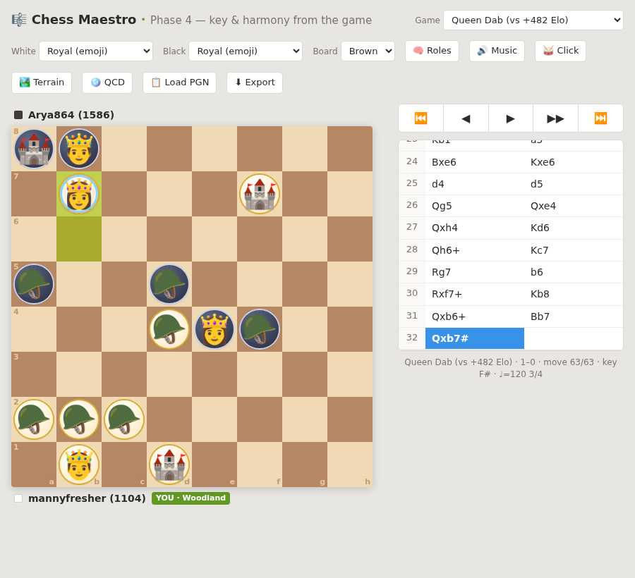
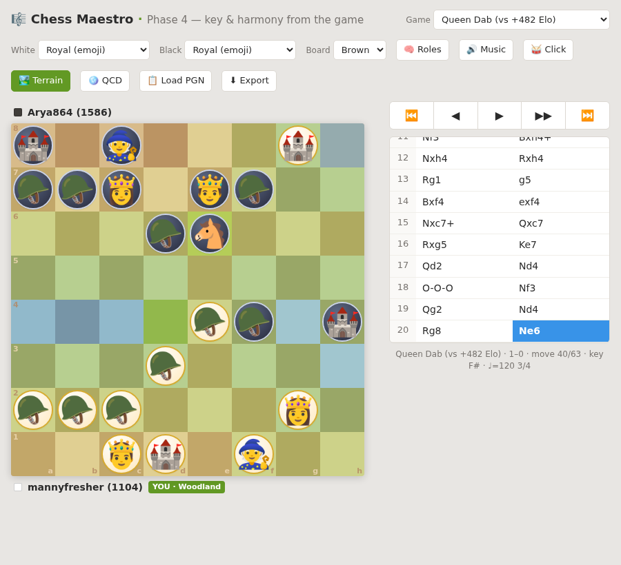
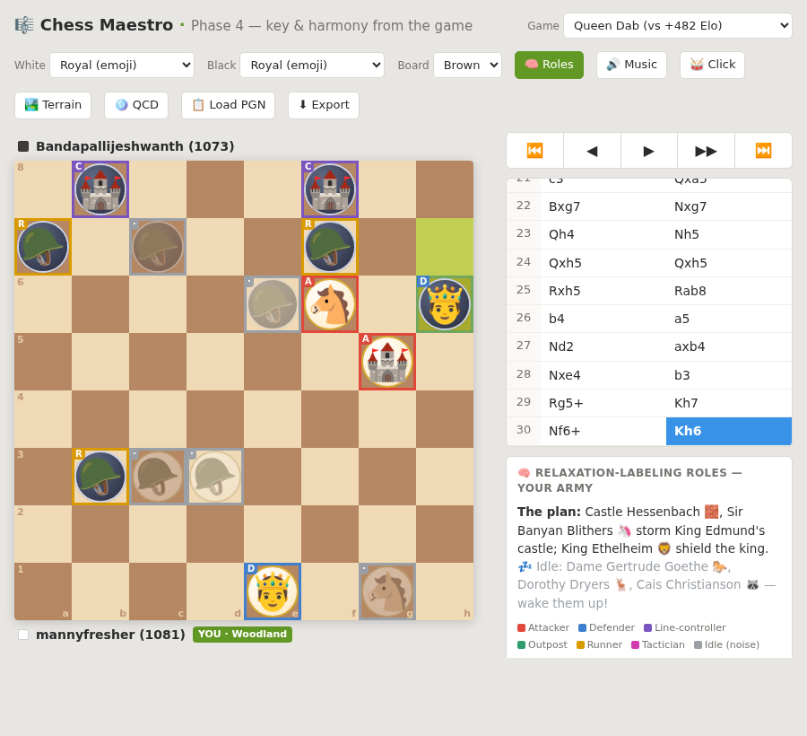
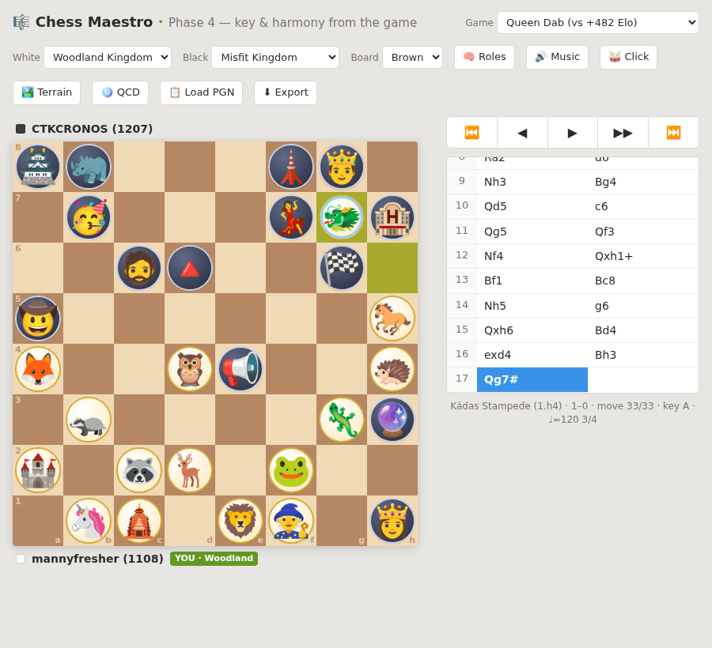
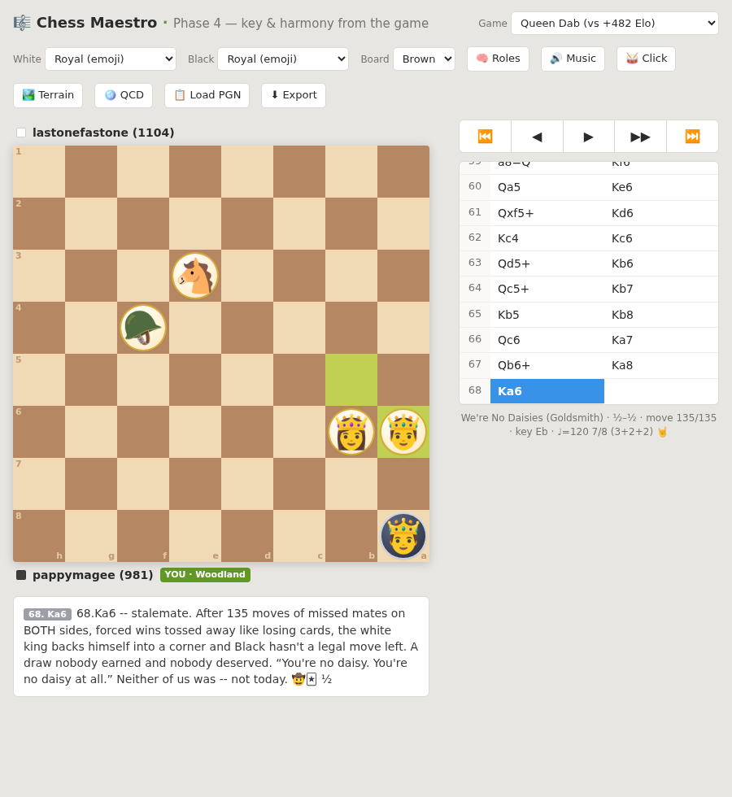

# ♟️ Whimsy-Chess — relaxation labeling, played for fun

> *"Daring & creativity over the engine's book."*

The creative, applied face of this portfolio. The **same hierarchical
relaxation-labeling engine** that tracks motion-capture markers and grades
physics claims also: segments a chessboard into **terrain**, labels pieces by
**tactical role**, and — in the [chess-maxims demo](../examples/chess_maxims_demo.py)
— grades the book's rules of thumb against real games. Here it's wrapped in a
narrated, musical, emoji study app.

Two surfaces, one cast of characters (the **Woodland Agents** 🦊🐲🦁 — you — vs.
the **Misfit Squad** 👸🤴🦏):

- **🎹 Chess Maestro** ([`maestro.html`](maestro.html)) — a self-contained PWA: emoji board,
  character narration, terrain & role overlays, and **music generated from the
  moves** (key + meter inferred from the game).
- **⌨️ Vim Chess** (`chess_emoji.vim`) — the same study, native in a Vim buffer.

### [▶️ **Play Chess Maestro now →**](maestro.html)

Runs straight in the browser — no install needed. On phone or desktop, use your
browser's **"Install" / "Add to Home Screen"** to keep it as an offline app: it's
a full PWA (manifest + service worker), so it plays with no network at all.

---

## 🎬 A game playing out — the Kádas Stampede



---

## 🏆 Checkmate, narrated — the Queen Dab

Emoji armies, a hero-aware story voice, and the meta strip showing the musical
**key & meter inferred from the game** (`key F# · ♩=120 3/4`):



> *"Queen Dilorias 🐲 DABS on b7! Checkmate. An 1104 just dabbed on a 1586 —
> daring beat the database."*

---

## 🏞️ The board as a world — terrain overlay

This is **relaxation labeling you can see**: the engine segments the 64 squares
into white / contested / black territories, then renders the result as
topography — **water on the contested seam, land rising by elevation**. The same
heightmap exports to a 3-D Roblox world.



## 🧠 Pieces by role — the HRL role-labeler

Each piece tinted by its relaxed role — attacker, defender, controller, outpost,
runner, or idle "noise":



## 🦊 Choose your cast — Woodland vs. Misfit



## 🤠 "We're No Daisies" — a Doc Holliday stalemate

135 moves, both sides missing forced mates, a draw nobody earned — narrated in
the voice of *Tombstone*'s Doc Holliday:



> *"You're no daisy. You're no daisy at all." Neither of us was — not today.*

---

## ⌨️ Vim Chess — the same study, in your editor

The board renders right in a Vim buffer (emoji or classic figurines, toggle with
`t`; step with `l`/`→`):

```
  🌲  mannyfresher (1108)  --  Woodland Agents (you)
      CTKCRONOS (1207)     --  Misfit Squad
      Kádas Stampede  (1.h4)   ·   White wins! 1-0

 8 🏯🦏🔮👸🤴💎🐘🗼
 7 🤠🥳🧔🔺📢💃🏁🏨
 6 ⬛⬜⬛⬜⬛⬜⬛⬜
 5 ⬜⬛⬜⬛⬜⬛⬜⬛
 4 ⬛⬜⬛⬜⬛⬜⬛⬜
 3 ⬜⬛⬜⬛⬜⬛⬜⬛
 2 🦊🦡🦝🦌🦉🐸🦎🦔
 1 🏰🦄🛕🐲🦁🧙🐎🧱
   a b c d e f g h

  Start position   (0 / 33)
  l/→ next   h/← prev   < start   > end   t style   q quit
```

Step to the end and Queen Dilorias 🐲 stampedes onto g7 for mate:

```
 8 🏯🦏⬛⬜⬛🗼🤴⬜          8 ♜ ♞ · · · ♜ ♚ ·
 7 ⬜🥳⬜⬛⬜💃🐲🏨          7 · ♟ · · · ♟ ♕ ♟
 6 ⬛⬜🧔🔺⬛⬜🏁⬜          6 · · ♟ ♟ · · ♟ ·
 5 🤠⬛⬜⬛⬜⬛⬜🐎          5 ♟ · · · · · · ♘
 4 🦊⬜⬛🦉📢⬜⬛🦔   ⇄      4 ♙ · · ♙ ♟ · · ♙
 3 ⬜🦡⬜⬛⬜⬛🦎🔮          3 · ♙ · · · · ♙ ♝
 2 🏰⬜🦝🦌⬛🐸⬛⬜          2 ♖ · ♙ ♙ · ♙ · ·
 1 ⬜🦄🛕⬛🦁🧙⬜👸          1 · ♘ ♗ · ♔ ♗ · ♛
   a b c d e f g h            a b c d e f g h
   emoji cast                 classic figurines  (press t)
```

> *"Qg7# — Queen Dilorias 🐲 STAMPEDES onto g7. Checkmate. One queen, end to
> end, never once retreating."*

---

## ▶️ Run it

| Surface | How |
|---|---|
| 🎹 Maestro | [**open `maestro.html`**](maestro.html) in any browser (fully self-contained); or **Install** it as an offline PWA |
| ⌨️ Vim | `vim -c 'source chess_emoji.vim' -c 'ChessEmoji kadas'` — step with `l`/`h` |

🔊 **Audio:** in Maestro, press **🔊 Music**, or **⬇ Export → WAV / MIDI / Suno
prompt** — the key and meter are inferred from the moves. (Generated live in the
browser, so it isn't captured in these stills.)

*The Maestro PWA here is fully installable (manifest + service worker bundled). The
Roblox port and the broader engine live in the author's private working repo; this
is the polished, playable showcase.*
