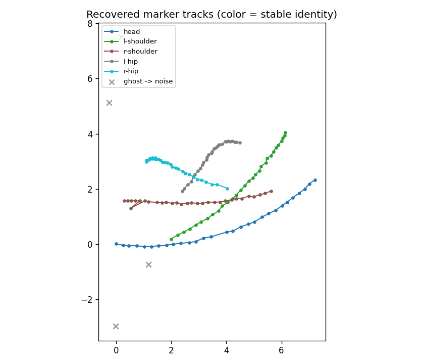

# hrl — hierarchical relaxation labeling

**One engine that assigns labels under context.** Give it a set of *objects*, a
set of *labels*, and a *compatibility* function that says how much one labeled
pair reinforces another. It iteratively relaxes the whole field into a
mutually-consistent labeling — the way scene-labeling, point correspondence,
and constraint satisfaction were meant to work.

The same engine, with only the compatibility kernel and prior changed:

| Domain | objects | labels | what compatibility encodes |
| --- | --- | --- | --- |
| **Motion capture** | measured 3-D points | named skeleton markers | inter-point distances match the model |
| **Strategy** | chess pieces | tactical roles | roles that co-occur in a real plan |
| **Model consensus** | observations / regimes | candidate theories | theories that agree in this regime |

This repository is a working, tested core plus a runnable demo. It's the spine
of a larger portfolio applying relaxation labeling to **markerless motion
capture** and to a **syncretistic, weighted consensus of physical models**.

---

## What makes this core different

Classic relaxation labeling (Rosenfeld–Hummel–Zucker) has two well-known
failure modes. This implementation fixes both:

- **Priors that are respected, not just seeded.** A naive labeler uses the
  prior only as iteration 0 and then lets the field wash it out — which can
  collapse every object onto one popular label. Here the prior is folded into
  the multiplicative base of *every* update. `prior_strength` slides from
  classic Hummel–Zucker (`0.0`) to a Bayesian "posterior ∝ prior × evidence"
  update (`1.0`).
- **A noise label for robustness.** An optional trailing "none of the above"
  class absorbs objects that are incompatible with the rest of the field —
  outliers, spurious detections, ghost markers — instead of forcing them into a
  wrong label. It doubles as a regularizer against over-confident labelings.

## Install

```bash
pip install -e .          # numpy is the only runtime dependency
```

## Use

```python
import numpy as np
from hrl import RelaxationLabeler, pairwise_distance_compatibility

# measured points (objects) and model markers (labels)
compat = pairwise_distance_compatibility(measured_points, model_markers, sigma=0.05)

result = RelaxationLabeler(
    compat,
    prior=None,        # or an [n_objects, n_labels] array of beliefs
    noise=True,        # add the "unlabeled" escape hatch
    prior_strength=0.5,
).run()

result.assignments     # object -> label index, or -1 for noise/unlabeled
result.confidence      # winning strength per object
result.strengths       # full per-object label distribution
```

## Demo

```bash
python examples/core_demo.py
```

```
1) MARKER CORRESPONDENCE  (motion-capture flavor)
   converged in 19 iterations
   measured point 0 -> r-shoulder  (0.57)  [OK]
   measured point 1 -> head        (0.57)  [OK]
   measured point 2 -> pelvis      (0.57)  [OK]
   measured point 3 -> l-shoulder  (0.57)  [OK]

2) NOISE LABEL  (an outlier is quarantined, not mislabeled)
   measured point 4 -> ** NOISE / unlabeled **

3) RESPECTED PRIOR  (a weak nudge settles a perfect tie)
   prior nudges object 0 toward label 0  -> assignment [0, 1]
   prior nudges object 0 toward label 1  -> assignment [1, 0]
```

## Motion-capture marker tracking

Single-frame correspondence becomes *tracking* with one addition: **memory,
expressed as a prior.** Each frame, the previous frame's labeled positions
predict where every marker should be now; that prediction is the prior for this
frame. Geometry keeps the constellation self-consistent, memory keeps
identities stable, and the noise label quarantines ghost detections.

```bash
python examples/mocap_tracking_demo.py
```

A rigid 5-marker body rotates and drifts for 30 frames; detections arrive
shuffled, with periodic ghosts and dropouts:

```
real-marker identity  : 146/146 correct (100.0%)
ghosts -> noise label : 4/5 quarantined
identity switches     : 0
```



Every marker holds its identity through the motion — note the two hip tracks
*cross* near the middle without swapping — and the gray ✕ ghosts are sent to
the noise label instead of corrupting a track.

```python
from hrl import track_sequence
assignments = track_sequence(frames, model_markers)   # per frame: detection -> marker id (-1 = noise)
```

## Syncretistic model consensus

Every model is a simplification of the world, so the "true" picture is a
weighted reconciliation of many models against each other and against the
observations we trust most. The same engine does this: **claims are objects,
the labels are the three Trool truth values `{vfalse, ish, vtrue}`**, an
agreement/contradiction web is the compatibility kernel, and a few trusted
observations *anchor* the field and break its sign symmetry.

```bash
python examples/physics_consensus_demo.py
```

Eight physics claims plus one deliberately contested ninth, with only **two**
claims anchored as trusted observations:

```
[ vtrue +0.94]  The speed of light in vacuum is the same for every observer.  <- anchor
[vfalse -0.51]  Light propagates through a stationary luminiferous ether.
[ vtrue +0.48]  Gravity is the curvature of spacetime and propagates at c.
[ vtrue +0.96]  All objects fall at the same rate in a vacuum.  <- anchor
[vfalse -0.48]  Heavier objects fall faster than lighter ones.
[   ish +0.02]  Newtonian gravity predicts planetary orbits accurately.
```

Truth propagates from the two anchors across the whole web — recovering the
modern picture, rejecting the classical errors, and parking the genuinely
regime-limited claim on `ish` (`score ≈ 0`).

The agreement matrix is the only NLP-dependent part, and it is fully
**swappable** — hand-authored, the bundled lexical heuristic, or a real
natural-language-inference / embedding / LLM-judge front-end:

```python
from hrl.consensus import lexical_agreement, relax_truth, anchor_prior, truth_report
agreement = lexical_agreement(sentences)            # raw text -> agreement web
result = relax_truth(agreement, anchor_prior(n, {trusted_idx: VTRUE}))
truth_report(result)                                # per claim: truth + signed score
```

### Real NLP backends

The lexical heuristic is the floor. Two real models drop in as the agreement
provider — same signed-matrix interface, so nothing downstream changes:

- **NLI** (`hrl.nli.NLIAgreement`, `pip install -e '.[nli]'`) — a DeBERTa-v3
  natural-language-inference model reads every claim pair and scores
  `P(entail) − P(contradict)`. Entailing claims pull toward the same truth
  value, contradicting ones toward opposite. Runs locally, offline after the
  one-time model download.
- **Claude LLM-judge** (`hrl.llm_judge`, `pip install -e '.[llm]'` + an API key)
  — `extract_claims_llm` pulls atomic claims out of a *whole paper*, and
  `LLMAgreement` judges them with real world knowledge. The strongest backend
  for abstract or knowledge-heavy claims.

```bash
python examples/paper_consensus_demo.py        # NLI builds the web from raw prose
```

```
NLI-inferred relations (entail = +, contradict = -):
  c0 contradict c3   (-1.00)      # "X reduces mortality"  vs  "X has no effect"
  c3 agree    c4   (+0.98)        # the two null-result claims agree
  ...
anchored claim c1 as a trusted observation (vtrue):
  [ vtrue +0.55]  c0: Compound X significantly reduces patient mortality.
  [vfalse -0.52]  c3: Compound X has no effect on patient mortality.
```

The NLI model inferred the entire agreement web from raw text; relaxation then
propagated truth from one anchored replication across it.

```python
from hrl import NLIAgreement, extract_claims, relax_truth, anchor_prior, truth_report, VTRUE
claims = extract_claims(open("abstract.txt").read())
agreement = NLIAgreement()(claims)              # real model -> agreement web
truth_report(relax_truth(agreement, anchor_prior(len(claims), {0: VTRUE})))
```

### Grading chess theory — the whimsy-chess bridge

The same consensus engine grades **chess rules of thumb**, with the evidence
prior drawn from a corpus of *real games that break the book and win anyway*
(the narrated whimsy-chess study games — Maestro / Vim / Roblox). Maxims are
claims, the labels are `{vtrue, ish, vfalse}`, and the daring wins anchor the
field:

```bash
python examples/chess_maxims_demo.py
```

```
[   ish -0.05]  Control the center with your pawns and pieces.   (REFUTED by every Kadas game)
[ vtrue +0.45]  Develop all your pieces before you attack.
[ vtrue +0.45]  Castle early to keep your king safe.
[   ish -0.05]  Material advantage decides the game.   (REFUTED by Houdini won down ~9 points)
[ vtrue +0.93]  Storm the enemy king with a flank pawn.   (PROVEN by the Kadas wins)
[ vtrue +0.93]  Daring and initiative outweigh following the book.
```

Sound rules hold at `vtrue`; the dogmas the daring games refute relax to `ish`
— rules of thumb with real exceptions. It's the whimsy-chess thesis (creativity
over the engine's book) made quantitative, on the *same* relaxation engine that
labels chess pieces by role and physics claims by truth.

## Test

```bash
pytest            # or: python tests/test_core.py
```

## Layout

```
hrl/
  core.py       RelaxationLabeler — the prior-respecting, noise-aware engine
  kernels.py    pairwise_distance_compatibility — the marker-correspondence kernel
  tracking.py   temporal_prior + track_sequence — correspondence across time
  consensus.py  relax_truth — claims -> vtrue/ish/vfalse over an agreement web
  nli.py        NLIAgreement — DeBERTa-v3 NLI builds the agreement web from text
  llm_judge.py  LLMAgreement + extract_claims_llm — Claude backend (opt-in)
examples/
  core_demo.py               the three core behaviors
  mocap_tracking_demo.py     marker tracking through motion, ghosts, dropouts
  physics_consensus_demo.py  relax a web of physics claims to truth values
  paper_consensus_demo.py    real NLI model builds the web from raw prose
  chess_maxims_demo.py       grade chess rules of thumb against real games
tests/
  test_core.py       correspondence recovery, noise quarantine, prior tie-break
  test_tracking.py   identity stability through motion / shuffle / ghosts
  test_consensus.py  anchored truth propagation, ish for contested claims
```

## Background

Relaxation labeling assigns labels to objects by iteratively maximizing the
mutual support among compatible assignments — a parallel, soft constraint
solver. This core grew out of work on **3-D fiducial / marker correspondence
for motion capture**, where the task is to decide which measured point is which
named marker using only the geometry the points share.

> A. Rosenfeld, R. Hummel, S. Zucker. *Scene labeling by relaxation
> operations.* IEEE Trans. SMC, 1976.
> R. Hummel, S. Zucker. *On the foundations of relaxation labeling processes.*
> IEEE Trans. PAMI, 1983.

## License

MIT — see [LICENSE](LICENSE).
