# hrl — hierarchical relaxation labeling

**One engine that assigns labels under context.** Give it a set of *objects*, a
set of *labels*, and a *compatibility* function that says how much one labeled
pair reinforces another. It iteratively relaxes the whole field into a
mutually-consistent labeling — the way scene-labeling, point correspondence,
and constraint satisfaction were meant to work.

The same engine, with only the compatibility kernel and prior changed:

| Domain | objects | labels | what compatibility encodes |
| --- | --- | --- | --- |
| **Motion capture** | measured 3-D points | named skeleton markers | inter-point distances match the model |
| **Wearables** | accelerometer readings | body positions | the gravity vector points the same way, near in time |
| **Strategy** | chess pieces | tactical roles | roles that co-occur in a real plan |
| **Model consensus** | observations / regimes | candidate theories | theories that agree in this regime |

This repository is a working, tested core plus a runnable demo. It's the spine
of a larger portfolio applying relaxation labeling to **markerless motion
capture** and to a **syncretistic, weighted consensus of physical models**.

---

## ▶ Open Chess Maestro (live demo)

Try the interactive Chess Maestro (Maestro) in your browser — no install required.

- Live site: https://rmichaelglover.github.io/hrl-portfolio/

Click the link above to open Maestro (it will load as the site root). You can paste or upload PGNs using the Load panel inside Maestro.

---

## 🖼️ Gallery

**🎞️ The marker tracker, playing out frame-by-frame** — colored dots keep their
identity through the motion, gray ✕ ghosts are rejected to the noise label
(`python make_mocap_gif.py`):

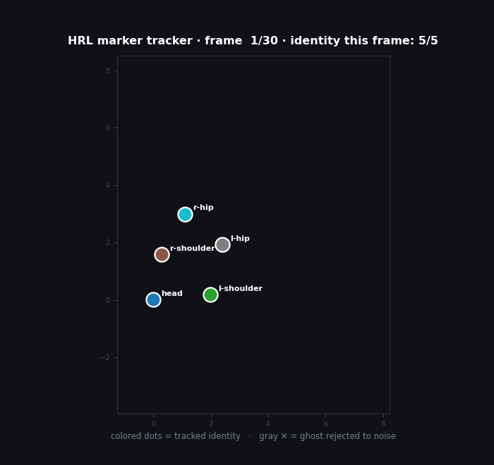

**🛏️ …and a night of sleep, labeled** — a wearable accelerometer's gravity
vector snaps to canonical postures while roll-over spikes fly off the gravity
sphere into the noise label (`python make_body_pos_gif.py`):

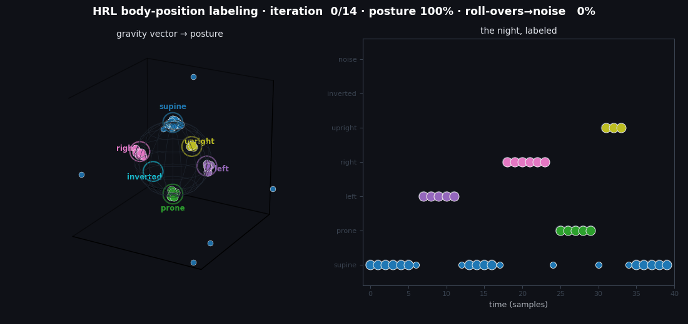

**🧬 …and a body that heals itself** — morphogenesis as relaxation labeling: an
amputated tail regrows, a wound closes (Michael Levin, in code):

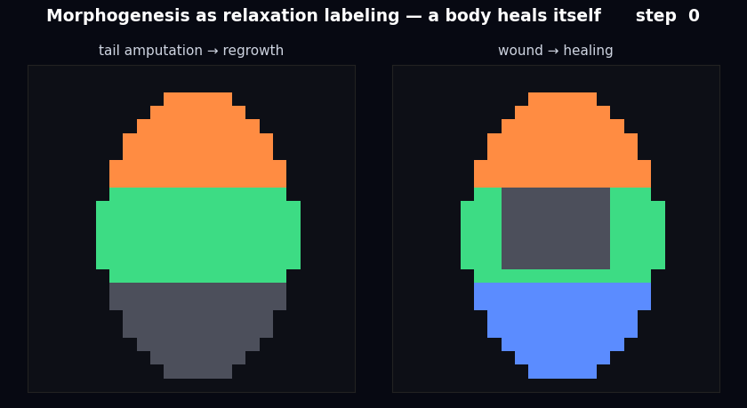

**⚖️ The Truth-O-Meter** — claims sliding to vtrue / ish / vfalse and lighting up
as the relaxation labeling iterates (`python make_consensus_viz.py`):

| Physics claims | Chess maxims |
|---|---|
| 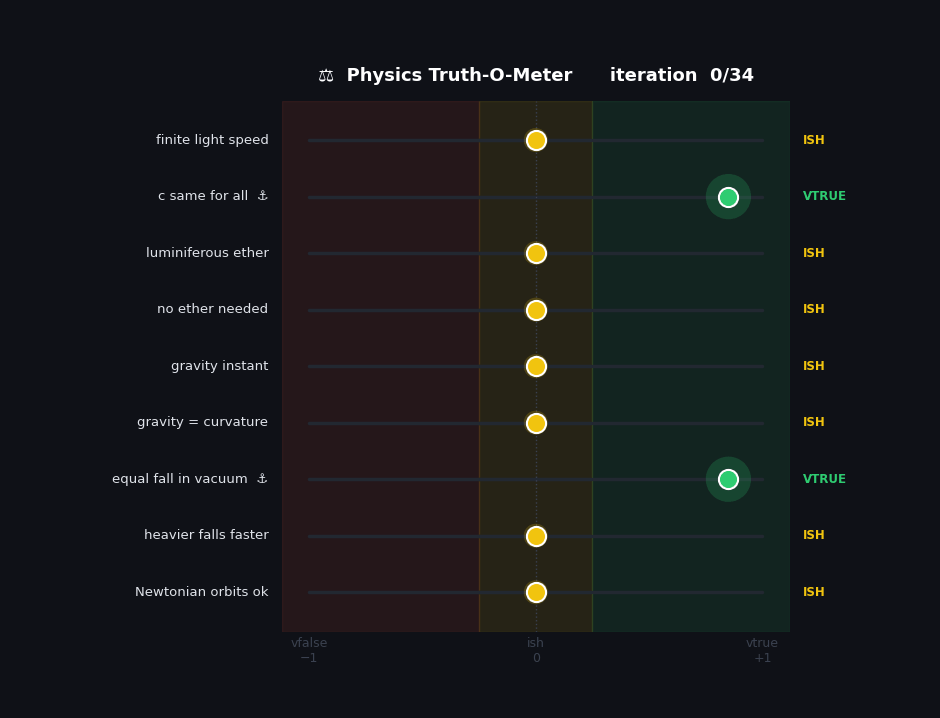 | 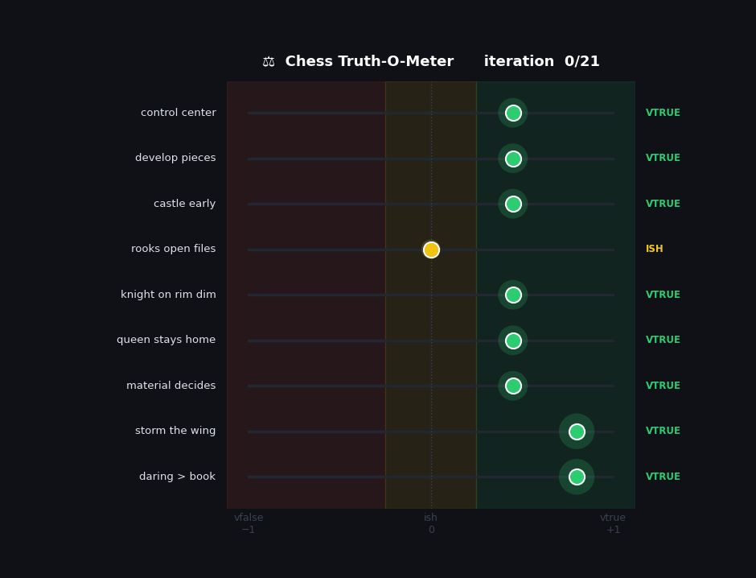 |

**🌌 …across the cosmos** — relativity, quantum gravity, and the dark sector
weighted by how proven each is (the speculative frontier rests honestly at `ish`):

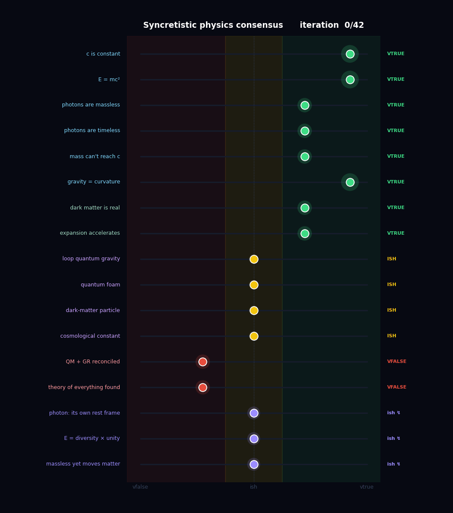

**🌀 …and tasting incompleteness** — Gödel's theorems, chess solvability, and a
little Kierkegaard; the self-referential claims stay pinned at `ish`:

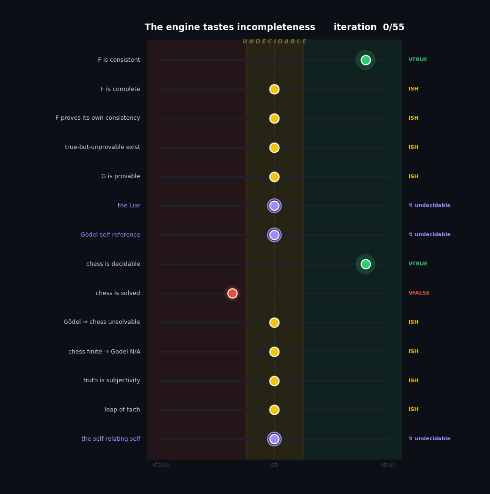

**🗺️ …and a self-organizing map** learning the topology of that truth-space —
the net unfolds to drape the manifold, undecidable claims at its peak:

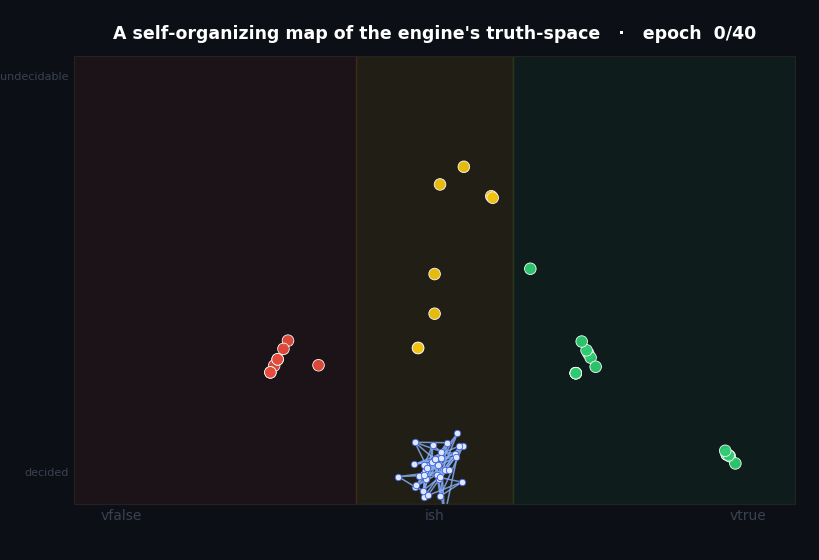

**🕊️ …and the leap of faith** — where Gödel's chasm meets Kierkegaard: refuse to
cross and starve, or leap by the absurd and flourish:

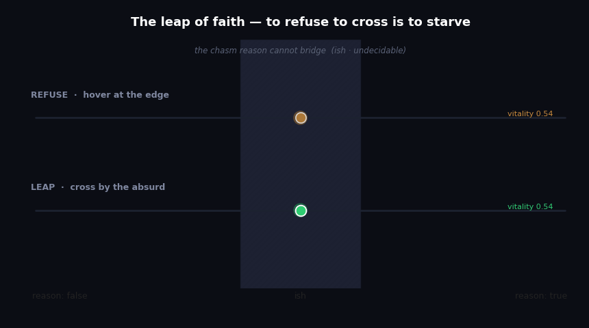

One engine, many worlds — every chart is real output (`python make_figures.py`,
full set in [`assets/`](assets/README.md)):

| 🎯 Core | 🕺 Mocap tracking |
|---|---|
|  |  |
| **⚛️ Physics consensus** | **♟️ Chess maxims** |
|  |  |

## ♟️ Applied: Whimsy-Chess

The same engine, [played for fun](whimsy-chess/README.md) — a narrated, musical,
emoji chess studio (the **Chess Maestro** PWA + a **Vim** version). The terrain
overlay *is* relaxation-labeling board segmentation; the role overlay *is* the
HRL labeler; and the [chess-maxims demo](examples/chess_maxims_demo.py) grades
the book's rules of thumb against real games.


→ **[Browse the whimsy-chess showcase »](whimsy-chess/README.md)**

## 📖 Applied: Relaxation Labeling Reads the Bible

The same engine, set upon the **King James scripture** (31,102 verses). An NLI
front-end (`hrl.nli`) judges pairs of verses by `agree = P(entail) − P(contradict)`
to surface **contradictions**, **kindred passages**, and **themes** — then a
relaxation pass sorts the fiercest contradiction-web into camps. The interactive
page ranks 29 famous contradictions, reveals where the machine goes *blind*
(it called "seven years" vs "three years" of famine a **harmony**), and draws an
arc-web of tensions across the four Gospels. Scholarly textual analysis; no verdict
on faith.

→ **[Open the live visualization »](https://rmichaelglover.github.io/hrl-portfolio/bible-hrl/)**

## 🧬 Morphogenesis — the engine grows a body

The circle closes. The same `RelaxationLabeler` that tracks markers, grades
theories, and tastes incompleteness now **regenerates a body** — Michael Levin's
picture of morphogenesis cast as relaxation labeling:

- **cells** are the objects, on a grid
- their **anatomical region** is the label (head / trunk / tail)
- **bioelectric gap-junction coupling** is the compatibility kernel — adjacent
  cells want to share an identity
- a coarse **pattern memory** (the blurred target morphology) is the respected
  prior — Levin's bioelectric setpoint

Wound the creature — punch a hole, or amputate the tail — and relaxation
propagates identity inward from the intact boundary, guided by the memory, until
the form grows back. Interior wounds heal to **100%**; an amputated tail regrows
**~88%** from boundary + memory alone.

```bash
python examples/morphogenesis_demo.py
```


**🐛🐛 Editable anatomical memory — Levin's two-headed planaria, in silico.** Edit
*only* the prior (the bioelectric setpoint), leaving the kernel and labels (the
"genome") untouched, and the same amputation regenerates **two heads** instead of a
head and a tail — a heritable re-targeting with no genomic change.

→ **[Open the live two-headed-planaria demo »](https://rmichaelglover.github.io/hrl-portfolio/morphogenesis/)**
 · [research proposal](morphogenesis/proposal.md)

**🌱 A body grows itself — morphogenesis on a *growing graph* (Milestone 2).** No fixed
lattice: a single seed-cell grows by recruiting neighbours (division), every cell labels
itself each step by relaxation, then the creature is amputated and *regrows* — wild-type a
tail, the setpoint-reprogrammed a second head, all on a living, changing substrate.

→ **[Open the live growing-body demo »](https://rmichaelglover.github.io/hrl-portfolio/morphogenesis-grow/)**

**🧠 Remodelling without injury — decision-driven division + apoptosis (Milestone 2.5).**
Now cells *commit* to an identity, *divide* only where the setpoint wants tissue, and
*apoptose* (the noise label) when the field disagrees. Flip the posterior setpoint of an
**intact** one-headed body and its tail cells die in a resorption wave and are replaced by
head cells — it becomes two-headed with **no amputation**. Homeostatic error-correction.

→ **[Open the live remodelling demo »](https://rmichaelglover.github.io/hrl-portfolio/morphogenesis-remodel/)**

**🔺 The body as a simplicial complex — the topological substrate for the hierarchy.** Lift
the body from a graph to a 2-complex (cells = 0-simplices, junctions = 1-simplices, tissue
patches = 2-simplices). Its **homology** is a health signature: a healthy body is a disk
(b₁=0); a wound is a **hole** (b₁=1), detected topologically. The white **seams** are the
anatomical-boundary sub-complex. This is the scaffold for Milestone 3 (relaxation across
simplex dimensions).

→ **[Open the live simplicial-complex view »](https://rmichaelglover.github.io/hrl-portfolio/simplicial/)**
 · [roadmap](simplicial/roadmap.md)

**🌐 The body in 3D — higher-order relaxation across simplex dimensions (Milestone 3).** A
rotating 3D organism (drag to spin) as a simplicial complex — 701 cells, 5,160 junctions,
10,424 tissue-patches. The engine now relaxes across *dimensions*: cell-scale (edges) **and**
tissue-scale (2-simplices). On this well-posed body the two scales **agree** — a coherent
multi-scale labelling. *(Honest note: higher-order's distinct advantage needs frustrated /
sparse problems — the next frontier; here edges already suffice.)*

→ **[Open the live 3D viewer »](https://rmichaelglover.github.io/hrl-portfolio/simplicial-3d/)**

**🔺👑 Chirality — where the 2-simplex *provably* beats pairwise.** The honest crown of the
hierarchy claim. A field of oriented triangles: a CCW colouring and its CW mirror have
**identical pairwise energy** (231/231 edges both — pairwise potentials are *blind* to
handedness) yet **opposite** chirality. Only the 2-simplex distinguishes them; higher-order
relaxation recovers the consistent CCW field from scratch while pairwise stays frustrated.
Chirality / left-right asymmetry is Levin's territory.

→ **[Open the live chirality demo »](https://rmichaelglover.github.io/hrl-portfolio/frustrated/)**

## 🔬 From the original research

The clean core in this repo is the distilled version of a longer body of work —
relaxation labeling applied to chess-piece roles, 3-D fiducial correspondence,
and more. Here is the **real role-labeler converging**: the Hummel–Zucker
strength of each piece's winning role climbing over 40 iterations (some pieces
commit fast, the runner takes its time), and the role-compatibility heatmap that
drives it.

| Strength over iterations | Role compatibility |
|---|---|
| 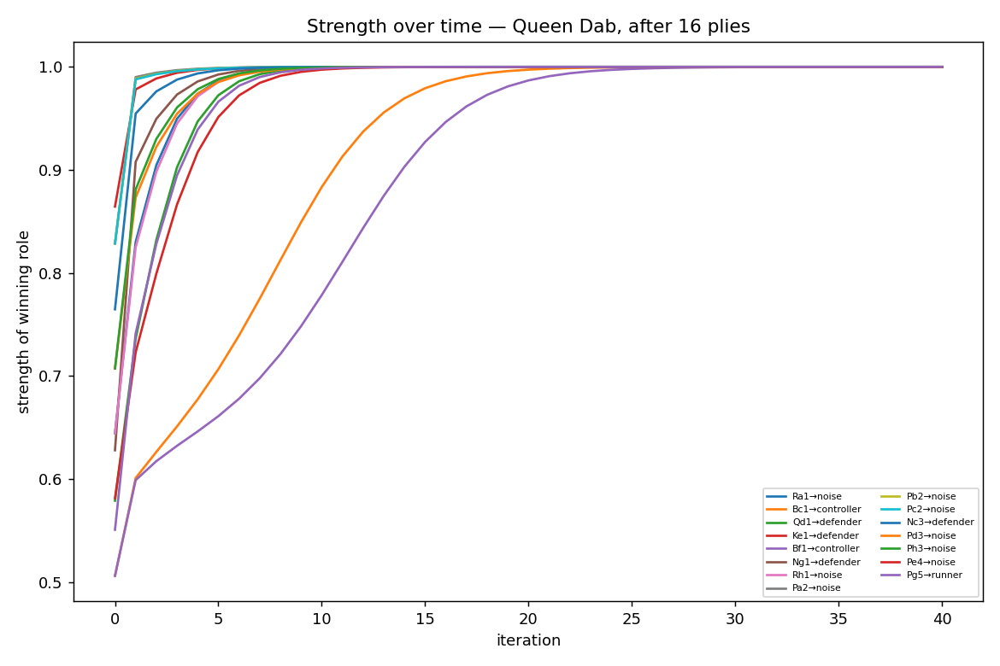 | 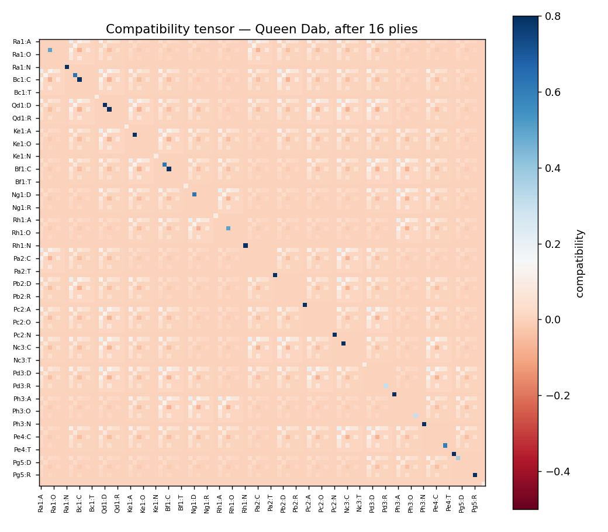 |

## What makes this core different

Classic relaxation labeling (Rosenfeld–Hummel–Zucker) has two well-known
failure modes. This implementation fixes both:

- **Priors that are respected, not just seeded.** A naive labeler uses the
  prior only as iteration 0 and then lets the field wash it out — which can
  collapse every object onto one popular label. Here the prior is folded into
  the multiplicative base of *every* update. `prior_strength` slides from
  classic Hummel–Zucker (`0.0`) to a Bayesian "posterior ∝ prior × evidence"
  update (`1.0`).
- **A noise label for robustness.** An optional trailing "none of the above"
  class absorbs objects that are incompatible with the rest of the field —
  outliers, spurious detections, ghost markers — instead of forcing them into a
  wrong label. It doubles as a regularizer against over-confident labelings.

## Install

```bash
pip install -e .          # numpy is the only runtime dependency
```

## Use

```python
import numpy as np
from hrl import RelaxationLabeler, pairwise_distance_compatibility

# measured points (objects) and model markers (labels)
compat = pairwise_distance_compatibility(measured_points, model_markers, sigma=0.05)

result = RelaxationLabeler(
    compat,
    prior=None,        # or an [n_objects, n_labels] array of beliefs
    noise=True,        # add the "unlabeled" escape hatch
    prior_strength=0.5,
).run()

result.assignments     # object -> label index, or -1 for noise/unlabeled
result.confidence      # winning strength per object
result.strengths       # full per-object label distribution
```

## Demo

```bash
python examples/core_demo.py
```

```
1) MARKER CORRESPONDENCE  (motion-capture flavor)
   converged in 19 iterations
   measured point 0 -> r-shoulder  (0.57)  [OK]
   measured point 1 -> head        (0.57)  [OK]
   measured point 2 -> pelvis      (0.57)  [OK]
   measured point 3 -> l-shoulder  (0.57)  [OK]

2) NOISE LABEL  (an outlier is quarantined, not mislabeled)
   measured point 4 -> ** NOISE / unlabeled **

3) RESPECTED PRIOR  (a weak nudge settles a perfect tie)
   prior nudges object 0 toward label 0  -> assignment [0, 1]
   prior nudges object 0 toward label 1  -> assignment [1, 0]
```

## Motion-capture marker tracking

Single-frame correspondence becomes *tracking* with one addition: **memory,
expressed as a prior.** Each frame, the previous frame's labeled positions
predict where every marker should be now; that prediction is the prior for this
frame. Geometry keeps the constellation self-consistent, memory keeps
identities stable, and the noise label quarantines ghost detections.

```bash
python examples/mocap_tracking_demo.py
```

A rigid 5-marker body rotates and drifts for 30 frames; detections arrive
shuffled, with periodic ghosts and dropouts:

```
real-marker identity  : 146/146 correct (100.0%)
ghosts -> noise label : 4/5 quarantined
identity switches     : 0
```


Every marker holds its identity through the motion — note the two hip tracks
*cross* near the middle without swapping — and the gray ✕ ghosts are sent to
the noise label instead of corrupting a track.

```python
from hrl import track_sequence
assignments = track_sequence(frames, model_markers)   # per frame: detection -> marker id (-1 = noise)
```

## Body-position labeling from a wearable

A torso-worn accelerometer reads the gravity vector in the body's frame, so each
reading points at one of six canonical postures — *posture classification is a
labeling problem.* The twist: those six directions form a **symmetric
octahedron**, so relative geometry *alone* is rotation-invariant and can't tell
"left" from "up." The fix is the engine's respected **prior**:

* **prior = absolute fit** — how close a reading sits to each canonical gravity
  vector. This breaks the symmetry and does the classifying.
* **compatibility = geometry + time** — readings near in sensor space (and near
  in time) should agree, so each posture stretch stays self-consistent.
* **noise label** — rolling over leaves the gravity sphere (a >1 g spike in an
  arbitrary direction); those readings go to noise instead of a wrong posture.

```bash
python examples/body_pos_demo.py
```

```
posture accuracy      : 34/34 correct (100.0%)
roll-overs -> noise   : 6/6 quarantined
```

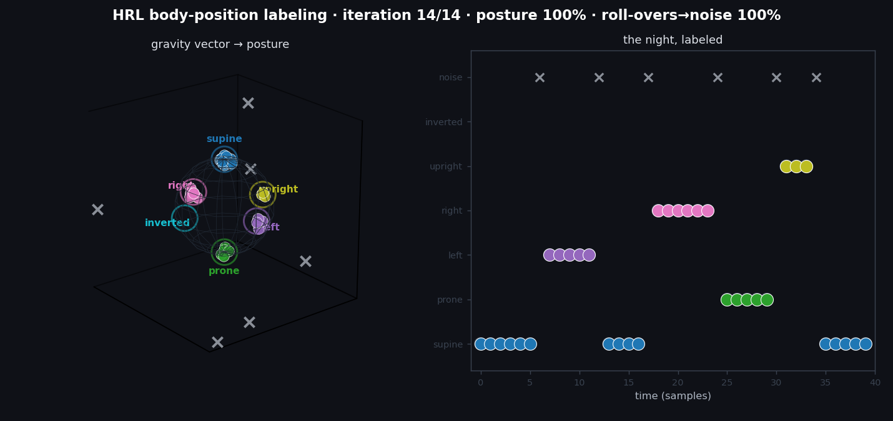

The gravity vectors snap to their postures, the night's hypnogram fills in, and
every roll-over is quarantined. Drop the prior and accuracy collapses to **0%** —
the octahedral symmetry pairs opposite axes together — which is exactly why the
respected prior matters. This mirrors the `body_pos` problem in the author's C++
relaxation-labeling engine, run there over real accelerometer logs.

```python
from hrl import classify_session
result = classify_session(readings, times=times)   # reading -> posture (-1 = movement/noise)
```

## Syncretistic model consensus

Every model is a simplification of the world, so the "true" picture is a
weighted reconciliation of many models against each other and against the
observations we trust most. The same engine does this: **claims are objects,
the labels are the three Trool truth values `{vfalse, ish, vtrue}`**, an
agreement/contradiction web is the compatibility kernel, and a few trusted
observations *anchor* the field and break its sign symmetry.

```bash
python examples/physics_consensus_demo.py
```

Eight physics claims plus one deliberately contested ninth, with only **two**
claims anchored as trusted observations:

```
[ vtrue +0.94]  The speed of light in vacuum is the same for every observer.  <- anchor
[vfalse -0.51]  Light propagates through a stationary luminiferous ether.
[ vtrue +0.48]  Gravity is the curvature of spacetime and propagates at c.
[ vtrue +0.96]  All objects fall at the same rate in a vacuum.  <- anchor
[vfalse -0.48]  Heavier objects fall faster than lighter ones.
[   ish +0.02]  Newtonian gravity predicts planetary orbits accurately.
```

Truth propagates from the two anchors across the whole web — recovering the
modern picture, rejecting the classical errors, and parking the genuinely
regime-limited claim on `ish` (`score ≈ 0`).

The agreement matrix is the only NLP-dependent part, and it is fully
**swappable** — hand-authored, the bundled lexical heuristic, or a real
natural-language-inference / embedding / LLM-judge front-end:

```python
from hrl.consensus import lexical_agreement, relax_truth, anchor_prior, truth_report
agreement = lexical_agreement(sentences)            # raw text -> agreement web
result = relax_truth(agreement, anchor_prior(n, {trusted_idx: VTRUE}))
truth_report(result)                                # per claim: truth + signed score
```

### Real NLP backends

The lexical heuristic is the floor. Two real models drop in as the agreement
provider — same signed-matrix interface, so nothing downstream changes:

- **NLI** (`hrl.nli.NLIAgreement`, `pip install -e '.[nli]'`) — a DeBERTa-v3
  natural-language-inference model reads every claim pair and scores
  `P(entail) − P(contradict)`. Entailing claims pull toward the same truth
  value, contradicting ones toward opposite. Runs locally, offline after the
  one-time model download.
- **Claude LLM-judge** (`hrl.llm_judge`, `pip install -e '.[llm]'` + an API key)
  — `extract_claims_llm` pulls atomic claims out of a *whole paper*, and
  `LLMAgreement` judges them with real world knowledge. The strongest backend
  for abstract or knowledge-heavy claims.

```bash
python examples/paper_consensus_demo.py        # NLI builds the web from raw prose
```

```
NLI-inferred relations (entail = +, contradict = -):
  c0 contradict c3   (-1.00)      # "X reduces mortality"  vs  "X has no effect"
  c3 agree    c4   (+0.98)        # the two null-result claims agree
  ...
anchored claim c1 as a trusted observation (vtrue):
  [ vtrue +0.55]  c0: Compound X significantly reduces patient mortality.
  [vfalse -0.52]  c3: Compound X has no effect on patient mortality.
```

The NLI model inferred the entire agreement web from raw text; relaxation then
propagated truth from one anchored replication across it.

```python
from hrl import NLIAgreement, extract_claims, relax_truth, anchor_prior, truth_report, VTRUE
claims = extract_claims(open("abstract.txt").read())
agreement = NLIAgreement()(claims)              # real model -> agreement web
truth_report(relax_truth(agreement, anchor_prior(len(claims), {0: VTRUE})))
```

### Grading chess theory — the whimsy-chess bridge

The same consensus engine grades **chess rules of thumb**, with the evidence
prior drawn from a corpus of *real games that break the book and win anyway*
(the narrated whimsy-chess study games — Maestro / Vim / Roblox). Maxims are
claims, the labels are `{vtrue, ish, vfalse}`, and the daring wins anchor the
field:

```bash
python examples/chess_maxims_demo.py
```

```
[   ish -0.05]  Control the center with your pawns and pieces.   (REFUTED by every Kadas game)
[ vtrue +0.45]  Develop all your pieces before you attack.
[ vtrue +0.45]  Castle early to keep your king safe.
[   ish -0.05]  Material advantage decides the game.   (REFUTED by Houdini won down ~9 points)
[ vtrue +0.93]  Storm the enemy king with a flank pawn.   (PROVEN by the Kadas wins)
[ vtrue +0.93]  Daring and initiative outweigh following the book.
```

Sound rules hold at `vtrue`; the dogmas the daring games refute relax to `ish`
— rules of thumb with real exceptions. It's the whimsy-chess thesis (creativity
over the engine's book) made quantitative, on the *same* relaxation engine that
labels chess pieces by role and physics claims by truth.

### 🌌 The cosmos — relativity, quantum gravity, the dark sector

The original syncretistic dream: every physical model is a simplification, so we
weight each by how *proven* it is and relax the web toward consistency. Confirmed
physics (c constant, E = mc², massless timeless photons) → **vtrue**; the genuinely
speculative frontier (loop quantum gravity, quantum foam, the dark-matter particle,
the cosmological constant) → **ish**; "a theory of everything has been found" →
**vfalse** (incompleteness, cosmic). And the self-referential reading of a photon —
always at `c`, hence in its own frame never moving, never aging — rests at `ish`,
where Gödel quietly chimes in.

```bash
python examples/quantum_consensus_demo.py
```


### 🌀 The engine tastes incompleteness — Gödel

Point the same consensus engine at the limits of formal reason — Gödel's
incompleteness theorems, the solvability of chess, a little Kierkegaard. The
decidable claims commit (incompleteness comes out **true**; "Gödel ⇒ chess
unsolvable" comes out **false** — chess is finite). But a field that rewards
*consistency* has nowhere to push a **self-referential** claim: the Liar, the
Gödel sentence, and "the self relates to itself" stay pinned in the central
`ish` band — undecidability, *felt*.

```bash
python examples/godel_consensus_demo.py
```


> *Decidable claims slide out to vtrue/vfalse; the violet self-referential
> markers quiver at `ish`, unable to move — the engine tasting its own limit.*

## 🗺️ Self-organizing maps

A SOM is relaxation labeling's competitive-learning cousin — both settle a field
by *local neighborhood coherence*. Here a SOM learns the 2-D topology of the
engine's **own truth-assignment space**: feed it every claim's assignment vector
(from the physics, chess, and Gödel demos) and the lattice unfolds to drape over
the manifold — vtrue / ish / vfalse become contiguous territory, with the
undecidable claims piled at the arch's peak. A model mapping the engine's output.

```bash
python examples/som_demo.py     # 94% tighter quantization; the map self-segments by truth
```


## 🕊️ The leap of faith — rational irrationality

Gödel showed reason cannot bridge every gap: some truths are real but unprovable
from within the system — the `ish` chasm of the Gödel demo. Kierkegaard stood at
that same gap and called the crossing **the leap of faith** — not the abandonment
of reason (that comes out *false* here), but a commitment *responsive to* the
limit reason itself reveals, yet not derived from it. Rational **and** irrational
at once.

And it isn't optional. An agent that refuses to commit hovers at the edge of the
chasm and its vitality drains — it **starves** (the apprehensive bug that won't
cross into uncharted territory). The one that leaps — committing across the
boundary before all the proof is in — flourishes. *To refuse the leap is despair;
to refuse to cross is to starve. Life requires leaps.*

```bash
python examples/kierkegaard_leap_demo.py
```


## Test

```bash
pytest            # or: python tests/test_core.py
```

## Layout

```
hrl/
  core.py       RelaxationLabeler — the prior-respecting, noise-aware engine
  kernels.py    pairwise_distance_compatibility — the marker-correspondence kernel
  tracking.py   temporal_prior + track_sequence — correspondence across time
  body_pos.py   classify_session — accelerometer readings -> body positions
  consensus.py  relax_truth — claims -> vtrue/ish/vfalse over an agreement web
  nli.py        NLIAgreement — DeBERTa-v3 NLI builds the agreement web from text
  llm_judge.py  LLMAgreement + extract_claims_llm — Claude backend (opt-in)
examples/
  core_demo.py               the three core behaviors
  mocap_tracking_demo.py     marker tracking through motion, ghosts, dropouts
  body_pos_demo.py           accelerometer readings -> sleep posture, a night
  physics_consensus_demo.py  relax a web of physics claims to truth values
  paper_consensus_demo.py    real NLI model builds the web from raw prose
  chess_maxims_demo.py       grade chess rules of thumb against real games
tests/
  test_core.py       correspondence recovery, noise quarantine, prior tie-break
  test_tracking.py   identity stability through motion / shuffle / ghosts
  test_body_pos.py   posture recovery, roll-overs to noise, prior necessity
  test_consensus.py  anchored truth propagation, ish for contested claims
```

## Background

Relaxation labeling assigns labels to objects by iteratively maximizing the
mutual support among compatible assignments — a parallel, soft constraint
solver. This core grew out of work on **3-D fiducial / marker correspondence
for motion capture**, where the task is to decide which measured point is which
named marker using only the geometry the points share.

> A. Rosenfeld, R. Hummel, S. Zucker. *Scene labeling by relaxation
> operations.* IEEE Trans. SMC, 1976.
> R. Hummel, S. Zucker. *On the foundations of relaxation labeling processes.*
> IEEE Trans. PAMI, 1983.

## License

MIT — see [LICENSE](LICENSE).
