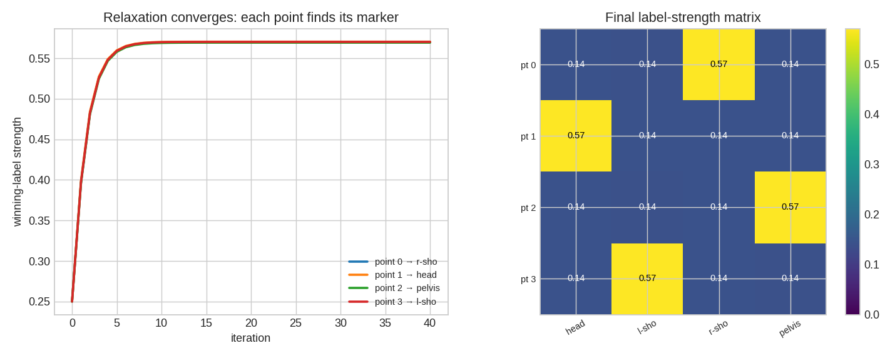
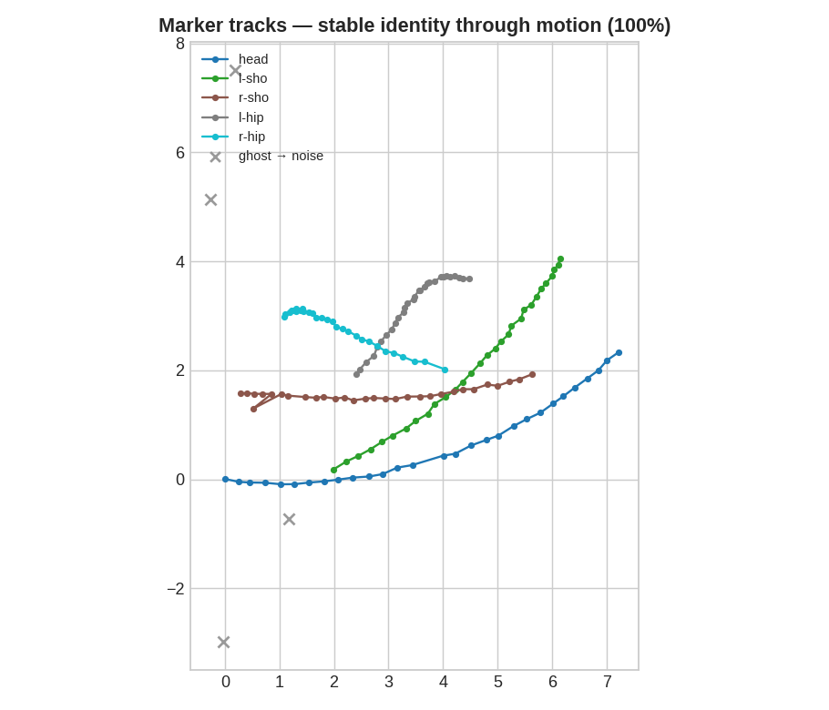
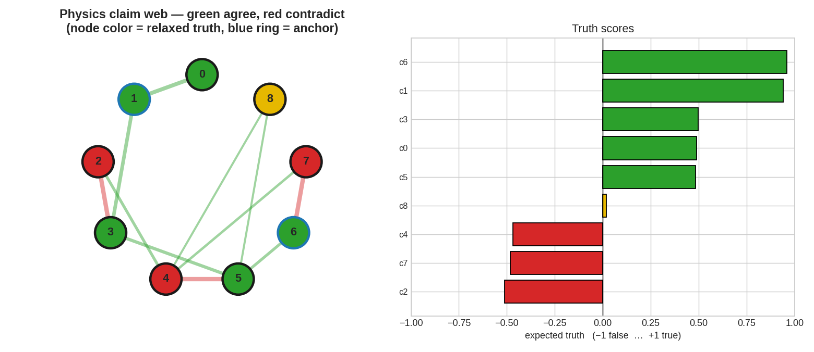
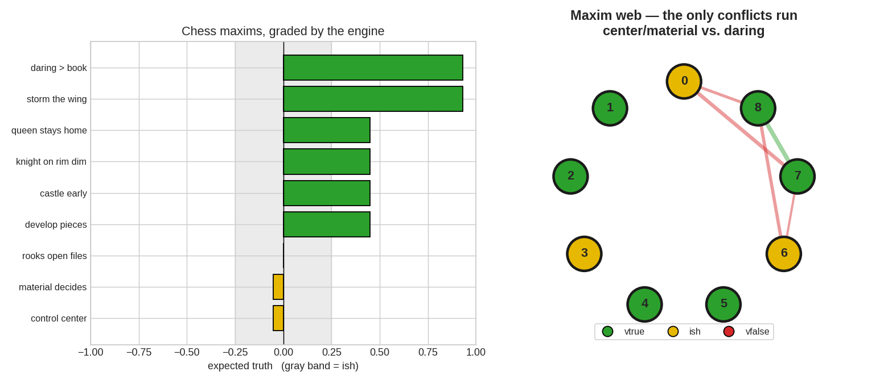
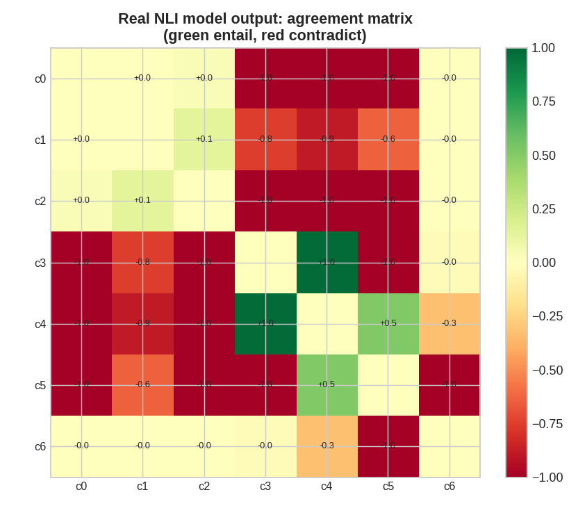

# 🖼️ Gallery

Every figure here is **real output from the engine** — regenerate them all with
`python make_figures.py` from the repo root.

---

## 🎯 Core — relaxation labeling

*Left:* each measured point's winning-label strength climbing to a confident,
stable assignment. *Right:* the final object × marker strength matrix — the
permuted-diagonal lights up because every point found its true marker.

---

## 🕺 Motion-capture marker tracking

Five markers on a rigid body, rotating and drifting for 30 frames with shuffled
detections, ghosts, and dropouts. Each colored track holds a **stable identity**
(the two hip tracks even cross without swapping); the gray ✕ ghosts are routed
to the noise label. **146/146 identity, 0 switches.**

---

## ⚛️ Physics consensus

The claims as a graph — **green = agree, red = contradict**, blue-ringed nodes
are the two anchored observations. From those anchors, relaxation propagates
truth across the whole web and sorts every claim into 🟢 `vtrue` / 🟡 `ish` /
🔴 `vfalse` (bars, right).

---

## ♟️ Chess maxims — the whimsy-chess bridge

The book's rules of thumb, graded against a corpus of **daring wins that break
the book and win anyway**. Sound rules stay 🟢 `vtrue`; the dogmas your Kádas
wins refute ("control the center", "material decides") relax into the 🟡 `ish`
band. Right: the conflict graph — the only tensions run *center/material vs.
daring*.

---

## 🧠 Real NLI model

Raw output of a **DeBERTa-v3 NLI model**: the agreement matrix it infers from
raw prose (🟩 entail, 🟥 contradict). This is what feeds the consensus engine
when you point it at real text.
