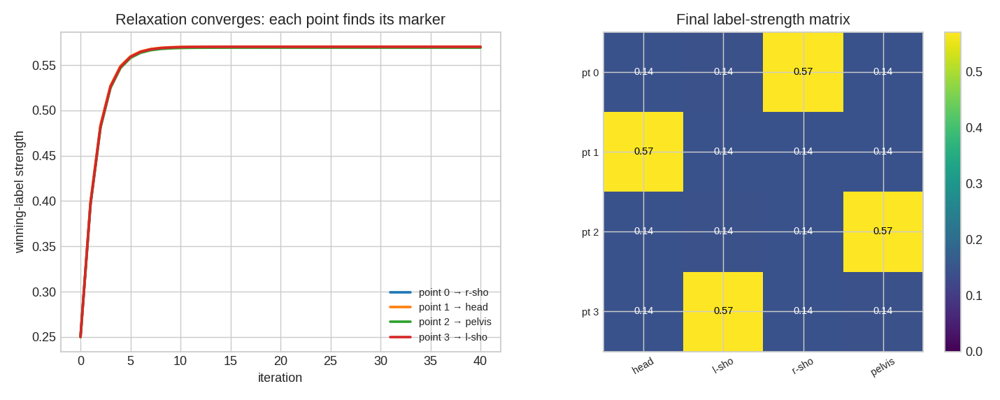
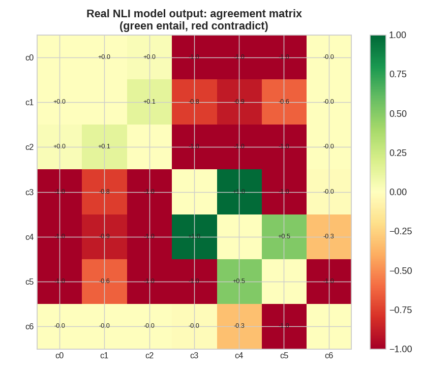

# 🧬 `hrl/` — the engine

One `RelaxationLabeler`. Change `(labels, compatibility, prior)` and the same
machine labels a different world.

```
        objects ─┐
                 ├──▶  RelaxationLabeler  ──▶  strengths ──▶ assignments
   compatibility ┤        (Hummel–Zucker          │
          prior ─┘         + respected prior       └─▶ noise label  (−1)
                            + noise label)
```

| Module | What it is |
|---|---|
| `core.py` | `RelaxationLabeler` — the prior-respecting, noise-aware relaxation engine |
| `kernels.py` | `pairwise_distance_compatibility` — rotation/translation-invariant point correspondence |
| `tracking.py` | `temporal_prior` + `track_sequence` — correspondence across time (the prior is memory) |
| `consensus.py` | `relax_truth` — claims → `vtrue`/`ish`/`vfalse` over an agreement web |
| `nli.py` | `NLIAgreement` — a DeBERTa-v3 NLI model builds the agreement web from text |
| `llm_judge.py` | `LLMAgreement` + `extract_claims_llm` — Claude backend (opt-in) |
| `meggers.py` | generic delimiter/delimited relaxation; `ish` marks a fuzzy boundary |

## MEGGERS: generic delimitation

**MEGGERS** — Maximally Elucidative Generic Grabby Engine, Relaxed Somewhat —
relaxes one distinction: delimiter versus delimited. Delimiter reads as
`vtrue`, delimited as `vfalse`, and `ish` records a boundary that remains fuzzy.
The input geometry is deliberately unspecified. Ordinary sets, image regions,
graphs, and simplicial complexes can all supply relationships or hierarchy
groups; none is part of MEGGERS' defining contract.

## What makes the core different 🧠

* **Respected prior** — folded into the multiplicative base of *every* update
  (`prior_strength` slides from classic Hummel–Zucker to Bayesian), so
  informative priors don't wash out and the field can't collapse onto one label.
* **Noise label** — a trailing "none of the above" class that absorbs outliers /
  spurious detections and regularizes against over-confident labelings.

## Future exploration: infinite priors ♾️

The core currently rejects non-finite priors. That is the safe numerical
behavior: ordinary normalization cannot distinguish an intentional hard
constraint from an accidental infinity, and operations such as ``inf / inf``
produce ``NaN``.

Still, an “infinite prior” may be a meaningful feature if it is defined
deliberately—for example, as a locked label or as the finite-limit behavior of
increasingly strong evidence. Future work can compare those semantics and
decide how hard constraints should interact with compatibility, noise, and
contradictory locked labels. Until then, infinity remains a fascinatingly
fishy edge of the model rather than an implicit input convention.

### Related future direction: generation from the null set

Generative set theory offers a different and legitimate interpretation of
emptiness: the null set can seed a construction from which progressively richer
objects are generated. That research direction is compatible with HRL's wider
interest in emergence, but it is not the same contract as labeling an existing
finite collection. The current numerical engine therefore requires at least
one object and one candidate label. A future generative formulation may define
null-set initialization explicitly; this implementation does not yet do so.

## Parked prototype idea: Mine for Truth ⛏️

A family-friendly, Minecraft-like world in which players mine not for an
absolute answer, but for progressively better-supported approximations of
**Truth**. Capital-T Truth is deliberately non-religious and non-spiritual so
families of any religious, spiritual, or secular persuasion can play together.

The world yields claims with different evidential roles: truths, lies, facts,
distortions, clarifications, and newly coined names. Players compare them,
discover context, revise labels, and learn that stronger evidence can move a
model closer to Truth without granting perfect possession of it. HRL supplies
the underlying mechanic: labels relax as neighboring evidence changes.

The intended audience includes children. Topics and generated content must
therefore remain age-appropriate and noncontroversial: no sexualized material,
partisan persuasion, religious instruction, or other adult-content escalation.
The fun should come from exploration, evidence, naming, cooperation, and
correcting earlier guesses. This idea is recorded for later exploration; it is
not part of the current implementation roadmap.

Watch it converge — each point's winning-label strength climbing to a stable,
confident assignment, and the final strength matrix lighting up the correct
(permuted) marker for every point:



## Real NLP, lazily loaded 🔌

`import hrl` stays **numpy-only** — `transformers`/`torch` (for `nli.py`) and
`anthropic` (for `llm_judge.py`) are imported only when you actually use those
backends. Here's the real NLI model's agreement matrix on raw prose:



➡️ Full gallery: [`../assets/`](../assets/README.md)
