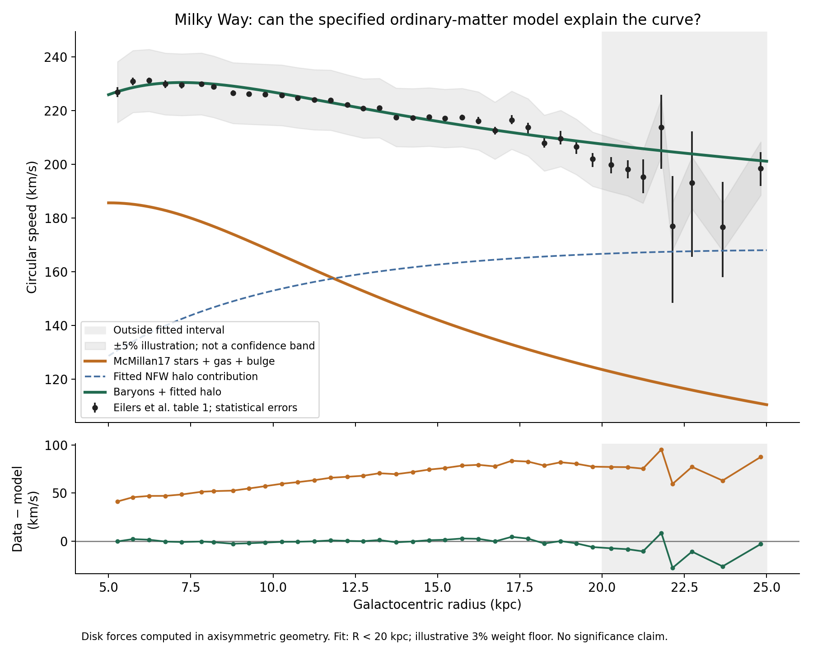
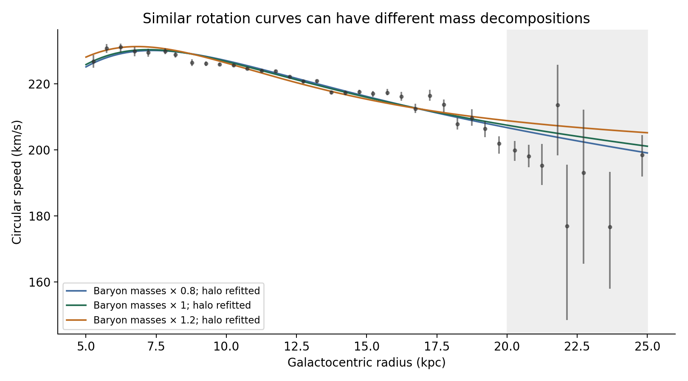

# The Oort–halo study meets real Milky Way data

The specified ordinary-matter model falls well below the published rotation curve. Adding a spherical NFW halo produces a close fit over 5–20 kpc. This is a reproducible comparison within Newtonian gravity, not a measurement of dark-matter particles or a rejection of every possible ordinary-matter distribution.



## What we compared

We extracted all 38 numerical rows of table 1 in [Eilers et al., The Circular Velocity Curve of the Milky Way from 5 to 25 kpc](https://arxiv.org/html/1810.09466). These are inferred circular speeds from stellar dynamics under axisymmetric Jeans assumptions, not direct measurements of stars on circular orbits. The reported asymmetric errors are statistical. The paper describes additional systematics of roughly 2–5% out to 20 kpc, increasing farther out.

For ordinary matter we use the bulge and disk potentials from galpy's implementation of [McMillan (2017)](https://academic.oup.com/mnras/article/465/1/76/2417479): thin and thick stellar disks, atomic and molecular gas disks, and an axisymmetric bulge. The published halo is excluded; we fit a new halo. These baryonic parameters originally came from a joint Galactic mass-model analysis, so this baseline is not an independently measured, assumption-free inventory.

We compute disk gravity using the actual flattened potential:

    vc²(R) = R ∂Φ(R,z=0)/∂R
    vc,total² = vc,baryons² + vc,halo²

Speeds do not add linearly. A disk is not a spherical shell, so spherical enclosed-mass formulas are not used for its force.

The spherical NFW halo has density rho_s / [x(1+x)²], where x=R/r_s. Its enclosed mass is 4π rho_s r_s³ [ln(1+x)−x/(1+x)]. Its circular-speed contribution follows G M(<R)/R.

## Results of this calculation

| Radius (kpc) | Published speed (km/s) | Ordinary matter (km/s) | Ordinary matter + fitted halo (km/s) | Radial force unaccounted for by ordinary matter |
|---|---:|---:|---:|---:|
| 8.19 | 228.86 | 176.89 | 229.84 | 40.3% |
| 14.74 | 217.60 | 143.24 | 216.49 | 56.7% |
| 19.71 | 201.91 | 124.51 | 207.93 | 62.0% |

The force fraction is 1−vc,baryons²/vc,data². It is not an enclosed dark-matter mass fraction: the ordinary-matter geometry is flattened.

Over the 30 bins below 20 kpc, the unweighted root-mean-square speed residual decreases from **66.72 km/s** for fixed ordinary matter to **2.00 km/s** after fitting two halo parameters. This is an in-sample descriptive comparison with different parameter counts, not a statistical significance or model-selection probability.

The nominal fit gives r_s=12.53 kpc and rho_s=1.54×10⁷ solar masses/kpc³. The implied halo mass inside 20 kpc is 1.29×10¹¹ solar masses. These are conditional model outputs without calibrated error bars. We do not extrapolate them to a total or virial Milky Way mass.

Eight outer bins are displayed but excluded from fitting. Their RMS residual is 15.30 km/s, much worse than the fitted interval. The halo fit should not be described as a precise explanation of the entire 5–25 kpc dataset.

## How fragile is the decomposition?



Scaling all ordinary-matter masses by 0.8, 1.0, and 1.2 while preserving their shapes and refitting the halo gives scale radii of 7.83, 12.53, and 27.13 kpc respectively. All three match the fitted speeds with RMS residuals around 2 km/s. Their halo masses inside 20 kpc span 1.18–1.42×10¹¹ solar masses. This sensitivity range is not a confidence interval.

We also vary the illustrative weighting floor from 2% to 5%, and repeat fitting with only R<15 kpc. Full outputs are in results.json. These are limited stress tests; disk scale lengths, gas structure, Solar-frame transformations, and non-axisymmetric dynamics are not varied here.

The nominal fitting weights combine each asymmetric statistical error with an assumed 3% speed floor in quadrature. The floor prevents tiny formal errors from dominating; it does not reconstruct the paper's systematic covariance. Real systematics can be correlated between radii. We therefore calculate no p-values, posterior uncertainty bands, or detection significance. The grey ±5% region on the plot is only an illustration, especially beyond 20 kpc.

## What survives our original analogy?

The Oort Cloud analogy remains useful for spherical gravity, enclosed mass, and the distinction between potential and force. A hollow spherical cloud supplies no acceleration inside its cavity. The fitted NFW halo instead contains mass throughout the radii sampled here and supplies substantial radial acceleration. An outer shell alone cannot supply this fitted interior force in Newtonian gravity.

The new experiment demonstrates a force shortfall for a specific ordinary-matter baseline and how an extended halo can supply it. Establishing the full Galactic mass distribution requires other tracers and constraints. Identifying the physical nature of dark matter requires evidence beyond this fit.

## Reproduce and inspect

```sh
python3 -m venv .venv
.venv/bin/pip install -r requirements.txt
.venv/bin/python model.py
```

The archived eilers-source.html makes reruns independent of a changing website. Its SHA-256 is recorded in results.json. Files include the extracted source table, per-bin predictions, parameter sensitivity cases, PNG figures, and publication-ready PDFs. The source article remains credited to its authors; its inclusion is for provenance, not a new publication of the article.

The script checks table shape and endpoint values, numerical potential gradients against radial forces, the analytic NFW formula against galpy, and addition of component squared speeds against the total potential. These checks passed. Figures were visually inspected.

Implementation reference: [galpy McMillan17 source](https://github.com/jobovy/galpy/blob/v1.12.0/galpy/potential/McMillan17.py). Published as the second experiment in the Oort–halo study.
